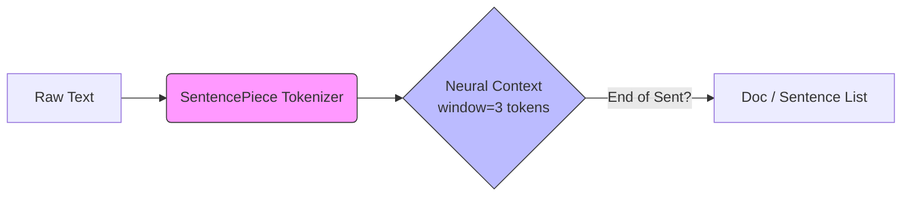

# Meitei Mayek Sentence Splitter

A customized, lightweight spaCy pipeline for splitting **Meitei Mayek (Manipuri)** text into sentences. It uses a hybrid approach with **SentencePiece** tokenization and a **Contextual Neural Network** to accurately detect sentence boundaries.


## � Model Specifications & Results

### Performance Metrics
Evaluated on a held-out validation set of 4,062 documents (~40k sentences).

| Metric | Score | Matches |
| :--- | :--- | :--- |
| **F-Score** | **94.71%** | Harmonic mean of Precision & Recall |
| **Precision** | **93.94%** | Accuracy of boundary predictions |
| **Recall** | **95.49%** | % of actual boundaries found |

### Model Details

| Feature | Specification |
| :--- | :--- |
| **Model Size** | **~252 KB** (Extremely Lightweight) |
| **Architecture** | CNN (HashEmbedCNN v2) with Window Size 1 |
| **Vocab Size** | 8,000 Subword Unigrams |
| **Tokenizer** | SentencePiece (Unigram) |
| **Pipeline** | `senter` (Sentence Recognizer) |
| **Language** | Custom / Multilingual (`xx`) |

---

## 🔄 Workflow

The system solves the ambiguity of sentence boundaries in Meitei Mayek (where delimiters like `||` might be used for other purposes) by learning local context.



1.  **Tokenization**: Splits complex Meitei words into subwords.
2.  **Senter (CNN)**: Scans the token stream. It looks at the **current token + neighbors** to decide if a sentence ends.

## 🚀 Quick Start

### 1. Installation

Requires **Python 3.11+**.

```bash
# Clone the repository
git clone https://github.com/Okramjimmy/mni_tokenizer.git
cd mni_tokenizer

# Create environment
conda create -y --name mni_tokenizer python=3.11
conda activate mni_tokenizer

# Install dependencies
pip install -r requirements.txt
```

### 2. Run Inference

You can test the model interactively in your terminal:

```bash
python inference.py --interactive
```

Type any Meitei sentence (e.g., `ꯆꯦꯔꯣꯀꯤ ꯑꯁꯤ...`) and hit Enter to see how it splits.

### 3. Use in Python

```python
import spacy
from meitei_tokenizer import MeiteiTokenizer

# Load the model
nlp = spacy.load("./output/model-best")
# Attach the custom tokenizer (Required!)
nlp.tokenizer = MeiteiTokenizer("meitei_tokenizer.model", nlp.vocab)

# Process text
text = "ꯆꯦꯔꯣꯀꯤ ꯑꯁꯤ ꯑꯣꯀ꯭ꯂꯥꯍꯣꯃꯥꯒꯤ ꯁꯍꯔꯅꯤ ꯫ ꯃꯁꯤ ꯌꯥꯝꯅ ꯆꯥꯎꯏ ꯫"
doc = nlp(text)

# Print sentences
for sent in doc.sents:
    print(sent.text)
```

## 📂 Repository Structure

-   `output/model-best`: The trained spaCy model.
-   `meitei_tokenizer.model`: The SentencePiece tokenizer model.
-   `meitei_tokenizer.py`: The custom wrapper code.
-   `inference.py`: Script to run the model.

*(Training scripts are included for reproducibility, but not required for usage.)*
